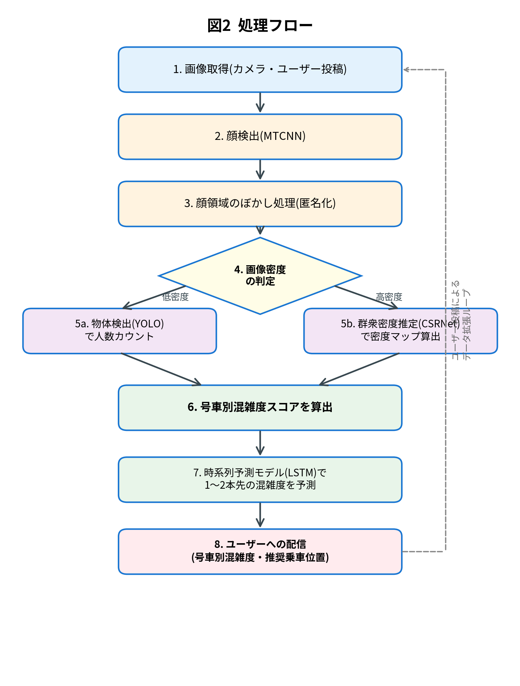

# 「スイてる号車 (Suiteru-Go)」— 通学時の電車混雑をAIで回避するアプリの企画・提案

**A2476255 　安部絢斗**

\---

## 1\. タイトル

**アプリケーション名:「スイてる号車 (Suiteru-Go)」**

駅ホームや車内のカメラ画像を画像認識AIで解析し、**号車ごとの混雑度**をリアルタイムに可視化するスマートフォンアプリケーション。

## 

## 2\. 目的と背景

### 解決したい課題

首都圏の通学ラッシュでは、同じ電車の中でも号車ごとに混雑度が大きく異なる。階段やエスカレーターに近い号車は極端に混み、両端の号車は比較的空いていることが多い。しかし乗客はこの偏りをホームに立った時点では知る手段がなく、経験と勘に頼らざるを得ない。

既存の乗換案内アプリにも混雑度表示機能はあるが、その多くは過去の乗車履歴データの統計に基づいており、当日の突発的な変動(遅延、イベント、天候)や、号車単位の粒度には対応していない。この 「情報の粒度と鮮度」のギャップ が、本アプリが解決したい中心的な課題である。

### 

### なぜこの課題に取り組むのか

自分自身が電車通学者であり、日々の混雑ストレスが学業効率や体調に及ぼす影響を実感していることが、個人的な動機である。社会的にも、朝の通勤・通学ストレスは労働生産性や公衆衛生に直結する問題であり、コロナ禍以降は「密の回避」という新たな要請も加わっている。画像認識AIは、この身近で普遍的な不便を解決するのに最も適した技術であると考える。

## 

## 3\. アプリケーションの概要

### 主な機能

* **リアルタイム号車別混雑度表示**:次に到着する電車の号車ごとの混雑度を4段階(空・普通・混雑・非常に混雑)で表示。
* **近未来混雑予測**:1〜2本先の電車の混雑度も予測して提示。
* **乗車位置ガイド**:「◯号車付近の乗車位置に移動しましょう」とホーム上の推奨位置を提案。
* **ユーザー投稿機能**:ユーザーがホームの様子を任意で投稿し、データ精度向上に貢献できる仕組み。

### 

### ユーザーの利用シーンと操作の流れ

利用者は朝、駅に向かう途中や改札前でアプリを起動する。以下がユーザー操作の流れである。

    [アプリ起動] → [出発駅・目的駅を入力] → [号車別混雑度を表示] → [推奨乗車位置に移動] → [空いている号車に乗車] → [任意で車内画像を投稿]

このように、ユーザーは電車が到着する前から乗車位置を最適化でき、無理な乗り込みを避けられる。

システム全体の構成

本アプリは、入力層からアプリケーション層まで5つの層からなる。カメラやユーザー投稿からの画像がエッジ処理層で匿名化され、AI解析層を経てクラウド層で集計・予測され、最終的にユーザーのスマホアプリへ配信される。

.png)

## 4\. 使用するAI技術

本アプリは複数の画像認識モデルを組み合わせるハイブリッド構成をとる。

|用途|モデル|選定理由|
|-|-|-|
|人物検出・カウント|**YOLO (You Only Look Once)**|1回の推論で高速に物体検出が可能で、モバイル端末上でも動作可能な軽量版が公開されている|
|群衆密度推定|**CSRNet (CNN-based)**|満員車両のように人物同士が重なり合う高密度環境でも、密度マップから人数を推定できる|
|プライバシー保護|**MTCNN (顔検出CNN)**|顔領域を高精度に検出でき、後段のぼかし処理と組み合わせやすい|
|近未来混雑予測|**LSTM (時系列モデル)**|曜日・時刻・天候などの時系列特徴量を扱え、周期的な混雑パターンを学習しやすい|

### 

### 選んだ理由

物体検出モデルは他にも Faster R-CNN 等が存在するが、YOLO はリアルタイム性に優れ、ホームでの即時提示という本アプリの要件に合致する。また、群衆密度推定を併用するのは、**満員車両では物体検出のみでは人数を過小評価してしまう**ためであり、二つの手法を混雑度に応じて使い分けることで精度と速度を両立する。

## 

## 5\. データの収集と処理方法

### 使用するデータの種類

* **画像データ**:駅ホームおよび車内の静止画・動画フレーム
* **メタデータ**:撮影時刻、曜日、路線、駅、車両号車、天候
* **既存の公開データセット**:COCO(物体検出の事前学習用)、ShanghaiTech(群衆密度推定用)

### 

### データ入手方法(ハイブリッド戦略)

1. **鉄道会社との公式連携**:駅ホームや車内に既設の防犯カメラ映像を、鉄道事業者との提携により活用する。安定した画角と網羅性が得られる。
2. **ユーザー投稿型クラウドソーシング**:ユーザーが撮影した画像を任意で投稿する仕組みを設ける。提携が難しい路線を補完し、初期のデータ不足を解消する。

### 

### 前処理の方針

* **顔検出→自動ぼかし処理**をエッジ側で先に実行し、個人が特定できない状態でのみ以降の解析を行う。
* **画像サイズの正規化**とデータ拡張(明るさ・角度変化)により、車両の照明条件差や撮影角度の違いに頑健なモデルを学習する。
* **アノテーション**は、初期は少量を手動で行い、その後は半教師あり学習で規模を拡張する。

処理の過程

画像取得からユーザー配信までの一連の流れを、以下に示す。画像密度に応じて物体検出と群衆密度推定を切り替える点、ユーザー投稿がデータ拡張ループとしてシステムに還流する点が特徴である。

## 6\. 技術的課題とその対策

|課題|対策|
|-|-|
|**プライバシー保護**:カメラ画像に個人が写り込む|顔検出+ぼかし処理をエッジ側で完結。生画像はサーバーに送らず、匿名化後の混雑度スコアのみをクラウドへ送信|
|**高密度シーンでの精度低下**:物体検出は重なりに弱い|群衆密度推定モデル(CSRNet)を併用し、密度に応じて手法を自動切り替え|
|**モバイル端末での計算負荷**:リアルタイム推論の重さ|モデルの量子化・軽量化(YOLOv8-nano等)と、集計処理のクラウド分担によるエッジ+クラウドのハイブリッド構成|
|**鉄道会社との連携形成**:営業・設備との調整コスト|一部路線でのパイロット導入から始め、有効性を実証したうえで段階的に拡大|
|**初期データ不足**:実地データがない状態からの立ち上げ|公開データセットでの事前学習と転移学習で対応。ユーザー投稿にインセンティブを付与して収集を加速|

## 

## 7\. 社会的インパクトと応用可能性

### 実現した場合の社会的効果

* **通学・通勤ストレスの軽減**:朝の混雑ストレスは学業や仕事のパフォーマンスに直結する。混雑回避を支援することで、生活の質(QOL)向上に寄与する。
* **公衆衛生の向上**:密を避けた乗車行動を後押しし、感染症対策としても機能する。
* **交通機関全体の負荷分散**:利用者行動が分散することで、特定号車への集中が緩和され、鉄道会社側の運行効率も改善する。
* **ユニバーサルデザインへの貢献**:妊婦、車椅子利用者、大きな荷物を持つ人など、混雑回避が特に重要なユーザーに直接的な恩恵をもたらす。

これは国連の持続可能な開発目標(SDGs)のうち、**目標11「住み続けられるまちづくりを」** の達成にも寄与する。

### 

### 他分野への応用可能性

本アプリの中核技術である **「画像による群衆密度のリアルタイム推定」** は、以下の分野にも応用可能である。

* **バス・地下鉄・空港**への横展開
* **観光地・イベント会場**における混雑分散案内
* **災害時の避難所**の収容状況モニタリング
* **商業施設**のフロア別混雑度表示

## 

## 8\. 今後の展望

### 

### 実装・検証・改善の計画

1. **プロトタイプ開発フェーズ**:単一路線・単一駅を対象に、既存の公開データセットで学習したモデルを用いてMVP(最小実用製品)を構築する。
2. **パイロット導入フェーズ**:大学や自治体、1〜2社の鉄道会社と協力し、限定エリアで実地検証を行う。ユーザーからのフィードバックとログデータでモデルを継続的に改善する。
3. **本格展開フェーズ**:精度と有用性の実証後、複数の鉄道事業者と提携し、対象路線を段階的に拡大する。

### 

### チーム開発・ビジネス展開の可能性

チーム構成としては、AIエンジニア、モバイルアプリ開発者、UI/UXデザイナー、鉄道事業者との渉外担当が想定される。ビジネスモデルとしては、**鉄道会社への課金モデル**(混雑分散による運行効率化の対価)、または**広告・プレミアム機能によるユーザー課金**の二本柱が考えられる。

## 

## 9\. 参考文献・資料

1. 国土交通省「三大都市圏における主要区間の混雑率」各年度版報告書
2. 個人情報保護委員会「カメラ画像利活用ガイドブック」

## 10\. 図表・構成図

